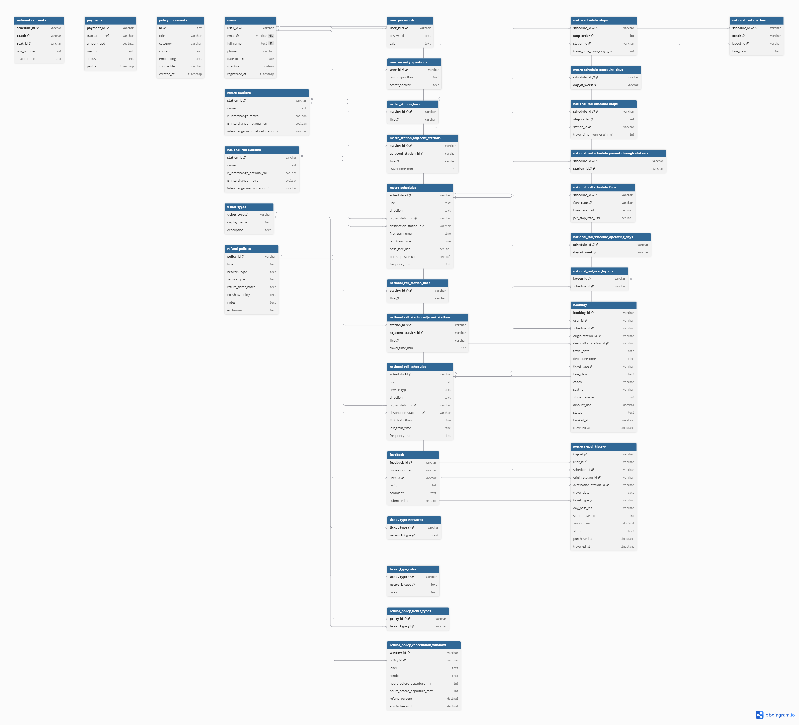

# Section 1 — Entity-Relationship Diagram
## 1.1 ER Diagram

The relational database is designed to support the structured data requirements of the TransitFlow assistant. It stores users, authentication information, metro stations, national rail stations, schedules, ordered schedule stops, fare rules, seating data, bookings, metro travel history, payments, feedback, refund policies, and policy documents for vector-based retrieval.

The ER diagram below shows the main entities, primary keys, foreign keys, representative attributes, and relationship cardinalities used in our relational database design.



The diagram was produced using dbdiagram.io. It shows the major entities and relationships from `databases/relational/schema.sql`, including `1:N` and `1:1` relationships where applicable.

---

## 1.2 ER Diagram Source and Schema Alignment

The ER diagram was generated using dbdiagram.io. The DBML source was written based on our actual PostgreSQL schema in `databases/relational/schema.sql`. The diagram includes the main entities, primary keys, foreign keys, representative attributes, and major relationship cardinalities required by the TransitFlow system.

Some implementation-level details, such as `CHECK` constraints, partial indexes, `ON DELETE` rules, and the HNSW vector index, are defined in `schema.sql` but are not fully shown in the diagram to keep the ER diagram readable. The DBML still includes the key foreign-key relationships used by the application, including the seating-related composite foreign keys.

The following DBML code was used to generate the ER diagram:

```dbml
Table users {
  user_id varchar [pk]
  email varchar [unique, not null]
  full_name text [not null]
  phone varchar
  date_of_birth date
  is_active boolean
  registered_at timestamptz
}

Table user_passwords {
  user_id varchar [pk, ref: > users.user_id]
  password text
  salt text
}

Table user_security_questions {
  user_id varchar [pk, ref: > users.user_id]
  secret_question text
  secret_answer text
}

Table metro_stations {
  station_id varchar [pk]
  name text
  is_interchange_metro boolean
  is_interchange_national_rail boolean
  interchange_national_rail_station_id varchar [ref: > national_rail_stations.station_id]
}

Table national_rail_stations {
  station_id varchar [pk]
  name text
  is_interchange_national_rail boolean
  is_interchange_metro boolean
  interchange_metro_station_id varchar [ref: > metro_stations.station_id]
}

Table metro_station_lines {
  station_id varchar [ref: > metro_stations.station_id]
  line varchar

  indexes {
    (station_id, line) [pk]
  }
}

Table national_rail_station_lines {
  station_id varchar [ref: > national_rail_stations.station_id]
  line varchar

  indexes {
    (station_id, line) [pk]
  }
}

Table metro_station_adjacent_stations {
  station_id varchar [ref: > metro_stations.station_id]
  adjacent_station_id varchar [ref: > metro_stations.station_id]
  line varchar
  travel_time_min int

  indexes {
    (station_id, adjacent_station_id, line) [pk]
  }
}

Table national_rail_station_adjacent_stations {
  station_id varchar [ref: > national_rail_stations.station_id]
  adjacent_station_id varchar [ref: > national_rail_stations.station_id]
  line varchar
  travel_time_min int

  indexes {
    (station_id, adjacent_station_id, line) [pk]
  }
}

Table metro_schedules {
  schedule_id varchar [pk]
  line text
  direction text
  origin_station_id varchar [ref: > metro_stations.station_id]
  destination_station_id varchar [ref: > metro_stations.station_id]
  first_train_time time
  last_train_time time
  base_fare_usd decimal
  per_stop_rate_usd decimal
  frequency_min int
}

Table metro_schedule_stops {
  schedule_id varchar [ref: > metro_schedules.schedule_id]
  stop_order int
  station_id varchar [ref: > metro_stations.station_id]
  travel_time_from_origin_min int

  indexes {
    (schedule_id, stop_order) [pk]
  }
}

Table metro_schedule_operating_days {
  schedule_id varchar [ref: > metro_schedules.schedule_id]
  day_of_week varchar

  indexes {
    (schedule_id, day_of_week) [pk]
  }
}

Table national_rail_schedules {
  schedule_id varchar [pk]
  line text
  service_type text
  direction text
  origin_station_id varchar [ref: > national_rail_stations.station_id]
  destination_station_id varchar [ref: > national_rail_stations.station_id]
  first_train_time time
  last_train_time time
  frequency_min int
}

Table national_rail_schedule_stops {
  schedule_id varchar [ref: > national_rail_schedules.schedule_id]
  stop_order int
  station_id varchar [ref: > national_rail_stations.station_id]
  travel_time_from_origin_min int

  indexes {
    (schedule_id, stop_order) [pk]
  }
}

Table national_rail_schedule_passed_through_stations {
  schedule_id varchar [ref: > national_rail_schedules.schedule_id]
  station_id varchar [ref: > national_rail_stations.station_id]

  indexes {
    (schedule_id, station_id) [pk]
  }
}

Table national_rail_schedule_fares {
  schedule_id varchar [ref: > national_rail_schedules.schedule_id]
  fare_class varchar
  base_fare_usd decimal
  per_stop_rate_usd decimal

  indexes {
    (schedule_id, fare_class) [pk]
  }
}

Table national_rail_schedule_operating_days {
  schedule_id varchar [ref: > national_rail_schedules.schedule_id]
  day_of_week varchar

  indexes {
    (schedule_id, day_of_week) [pk]
  }
}

Table national_rail_seat_layouts {
  layout_id varchar [pk]
  schedule_id varchar [ref: > national_rail_schedules.schedule_id]
}

Table national_rail_coaches {
  schedule_id varchar [ref: > national_rail_schedules.schedule_id]
  coach varchar
  layout_id varchar [ref: > national_rail_seat_layouts.layout_id]
  fare_class text

  indexes {
    (schedule_id, coach) [pk]
  }
}

Table national_rail_seats {
  schedule_id varchar
  coach varchar
  seat_id varchar
  row_number int
  seat_column text

  indexes {
    (schedule_id, coach, seat_id) [pk]
  }
}

Table ticket_types {
  ticket_type varchar [pk]
  display_name text
  description text
}

Table ticket_type_networks {
  ticket_type varchar [ref: > ticket_types.ticket_type]
  network_type text

  indexes {
    (ticket_type, network_type) [pk]
  }
}

Table ticket_type_rules {
  ticket_type varchar [ref: > ticket_types.ticket_type]
  network_type text
  rules jsonb

  indexes {
    (ticket_type, network_type) [pk]
  }
}

Table bookings {
  booking_id varchar [pk]
  user_id varchar [ref: > users.user_id]
  schedule_id varchar [ref: > national_rail_schedules.schedule_id]
  origin_station_id varchar [ref: > national_rail_stations.station_id]
  destination_station_id varchar [ref: > national_rail_stations.station_id]
  travel_date date
  departure_time time
  ticket_type varchar [ref: > ticket_types.ticket_type]
  fare_class text
  coach varchar
  seat_id varchar
  stops_travelled int
  amount_usd decimal
  status text
  booked_at timestamptz
  travelled_at timestamptz
}

Table metro_travel_history {
  trip_id varchar [pk]
  user_id varchar [ref: > users.user_id]
  schedule_id varchar [ref: > metro_schedules.schedule_id]
  origin_station_id varchar [ref: > metro_stations.station_id]
  destination_station_id varchar [ref: > metro_stations.station_id]
  travel_date date
  ticket_type varchar [ref: > ticket_types.ticket_type]
  day_pass_ref varchar [ref: > metro_travel_history.trip_id]
  stops_travelled int
  amount_usd decimal
  status text
  purchased_at timestamptz
  travelled_at timestamptz
}

Table payments {
  payment_id varchar [pk]
  transaction_ref varchar
  amount_usd decimal
  method text
  status text
  paid_at timestamptz
}

Table feedback {
  feedback_id varchar [pk]
  transaction_ref varchar
  user_id varchar [ref: > users.user_id]
  rating int
  comment text
  submitted_at timestamptz
}

Table refund_policies {
  policy_id varchar [pk]
  label text
  network_type text
  service_type text
  return_ticket_notes text
  no_show_policy text
  notes text
  exclusions text
}

Table refund_policy_ticket_types {
  policy_id varchar [ref: > refund_policies.policy_id]
  ticket_type varchar [ref: > ticket_types.ticket_type]

  indexes {
    (policy_id, ticket_type) [pk]
  }
}

Table refund_policy_cancellation_windows {
  window_id varchar [pk]
  policy_id varchar [ref: > refund_policies.policy_id]
  label text
  condition text
  hours_before_departure_min int
  hours_before_departure_max int
  refund_percent decimal
  admin_fee_usd decimal
}

Table policy_documents {
  id int [pk]
  title varchar
  category varchar
  content text
  embedding vector(768)
  source_file varchar
  created_at timestamptz
}

Ref: national_rail_seats.(schedule_id, coach) > national_rail_coaches.(schedule_id, coach)
Ref: bookings.(schedule_id, coach, seat_id) > national_rail_seats.(schedule_id, coach, seat_id)
```


## 1.3 Main Entities

The main relational entities in our PostgreSQL schema are:

* `users`: stores basic user profile information, including `user_id`, email, full name, phone number, date of birth, account status, and registration time.

* `user_passwords`: stores user password information separately from the main `users` table. It has a one-to-one relationship with `users` through `user_id`.

* `user_security_questions`: stores each user's secret question and secret answer for account recovery. It also has a one-to-one relationship with `users`.

* `metro_stations`: stores metro station master data, including station ID, station name, interchange flags, and the related national rail interchange station when applicable.

* `national_rail_stations`: stores national rail station master data, including station ID, station name, interchange flags, and the related metro interchange station when applicable.

* `metro_station_lines`: stores which metro lines each metro station belongs to. This separates station identity from line membership.

* `national_rail_station_lines`: stores which national rail lines each national rail station belongs to.

* `metro_station_adjacent_stations`: stores direct metro station-to-station connections, including the line and travel time between adjacent stations.

* `national_rail_station_adjacent_stations`: stores direct national rail station-to-station connections, including the line and travel time between adjacent stations.

* `metro_schedules`: stores metro schedule-level data, including line, direction, origin station, destination station, first train time, last train time, base fare, per-stop fare rate, and train frequency.

* `metro_schedule_stops`: stores the ordered stop sequence for each metro schedule. The `stop_order` and `travel_time_from_origin_min` fields allow the system to validate route direction and calculate journey information.

* `metro_schedule_operating_days`: stores the days of the week on which each metro schedule operates.

* `national_rail_schedules`: stores national rail schedule-level data, including line, service type, direction, origin station, destination station, first train time, last train time, and frequency.

* `national_rail_schedule_stops`: stores the ordered stop sequence for each national rail schedule.

* `national_rail_schedule_passed_through_stations`: stores the stations passed through by each national rail schedule, allowing faster lookup of whether a station is served by a schedule.

* `national_rail_schedule_fares`: stores fare rules for national rail schedules. The fare is separated by `fare_class`, with `base_fare_usd` and `per_stop_rate_usd` used for fare calculation.

* `national_rail_schedule_operating_days`: stores the days of the week on which each national rail schedule operates.

* `national_rail_seat_layouts`: stores seat layout records for national rail schedules.

* `national_rail_coaches`: stores coach information for each national rail schedule, including coach ID, layout ID, and fare class.

* `national_rail_seats`: stores individual seat records for each coach, including seat ID, row number, and seat column.

* `ticket_types`: stores ticket type definitions, including display name and description.

* `ticket_type_networks`: links ticket types to the network types they can be used on, such as metro or national rail.

* `ticket_type_rules`: stores rule details for each ticket type and network type using JSON data.

* `bookings`: stores national rail booking records, including user, schedule, origin and destination stations, travel date, departure time, ticket type, fare class, coach, seat, amount, and booking status.

* `metro_travel_history`: stores metro journey records, including user, schedule, origin and destination stations, travel date, ticket type, day-pass reference when applicable, fare, status, purchase time, and travel time.

* `payments`: stores payment records. Payments are linked to either bookings or metro travel history through `transaction_ref`.

* `feedback`: stores user feedback records, including transaction reference, user ID, rating, comment, and submission time.

* `refund_policies`: stores refund policy master data, including network type, service type, return ticket notes, no-show policy, notes, and exclusions.

* `refund_policy_ticket_types`: links refund policies to the ticket types they apply to.

* `refund_policy_cancellation_windows`: stores refund rules for different cancellation windows, including time limits, refund percentage, and administration fee.

* `policy_documents`: stores policy text documents and their vector embeddings for semantic search and RAG. The `embedding` column is used with pgvector for similarity search.


## 1.4 Relationship Cardinalities

The major relationships and their cardinalities are:

| Relationship                                                                 | Cardinality | Explanation                                                                                                                                                                                              |
| ---------------------------------------------------------------------------- | ----------: | -------------------------------------------------------------------------------------------------------------------------------------------------------------------------------------------------------- |
| `users` → `user_passwords`                                                   |         1:1 | Each user has exactly one password record, and each password record belongs to one user. Password data is separated from the main user profile for better security and organisation.                     |
| `users` → `user_security_questions`                                          |         1:1 | Each user has one security question record used for account recovery.                                                                                                                                    |
| `users` → `bookings`                                                         |         1:N | One user can make many national rail bookings, but each booking belongs to one user.                                                                                                                     |
| `users` → `metro_travel_history`                                             |         1:N | One user can have many metro travel history records, but each metro trip belongs to one user.                                                                                                            |
| `metro_travel_history` → `metro_travel_history`                              | Optional self-reference | The `day_pass_ref` column can link one metro trip to another trip record that represents the related day pass purchase.                                                                                |
| `users` → `feedback`                                                         |         1:N | One user can submit many feedback records, but each feedback record belongs to one user.                                                                                                                 |
| `metro_stations` → `metro_station_lines`                                     |         1:N | One metro station can belong to multiple metro lines.                                                                                                                                                    |
| `national_rail_stations` → `national_rail_station_lines`                     |         1:N | One national rail station can belong to multiple national rail lines.                                                                                                                                    |
| `metro_stations` → `national_rail_stations`                                 | Optional 0/1:1 | A metro station may reference one related national rail station when it is an interchange station; non-interchange stations leave this value null.                                                     |
| `national_rail_stations` → `metro_stations`                                 | Optional 0/1:1 | A national rail station may reference one related metro station when it is an interchange station; non-interchange stations leave this value null.                                                     |
| `metro_stations` → `metro_station_adjacent_stations`                         |         1:N | One metro station can have multiple adjacent metro station links.                                                                                                                                        |
| `national_rail_stations` → `national_rail_station_adjacent_stations`         |         1:N | One national rail station can have multiple adjacent national rail station links.                                                                                                                        |
| `metro_schedules` → `metro_schedule_stops`                                   |         1:N | One metro schedule contains many ordered stop records.                                                                                                                                                   |
| `metro_stations` → `metro_schedule_stops`                                    |         1:N | One metro station can appear in many metro schedule stop records.                                                                                                                                        |
| `metro_schedules` → `metro_schedule_operating_days`                          |         1:N | One metro schedule can operate on multiple days of the week.                                                                                                                                             |
| `national_rail_schedules` → `national_rail_schedule_stops`                   |         1:N | One national rail schedule contains many ordered stop records.                                                                                                                                           |
| `national_rail_stations` → `national_rail_schedule_stops`                    |         1:N | One national rail station can appear in many national rail schedule stop records.                                                                                                                        |
| `national_rail_schedules` → `national_rail_schedule_passed_through_stations` |         1:N | One national rail schedule can pass through many stations.                                                                                                                                               |
| `national_rail_stations` → `national_rail_schedule_passed_through_stations`  |         1:N | One national rail station can be passed through by many schedules.                                                                                                                                       |
| `national_rail_schedules` → `national_rail_schedule_fares`                   |         1:N | One national rail schedule can have multiple fare rules for different fare classes.                                                                                                                      |
| `national_rail_schedules` → `national_rail_schedule_operating_days`          |         1:N | One national rail schedule can operate on multiple days of the week.                                                                                                                                     |
| `national_rail_schedules` → `national_rail_seat_layouts`                     |         1:N | One national rail schedule can have one or more seat layout records.                                                                                                                                     |
| `national_rail_seat_layouts` → `national_rail_coaches`                       |         1:N | One seat layout can be used by multiple coaches.                                                                                                                                                         |
| `national_rail_coaches` → `national_rail_seats`                              |         1:N | One coach contains many seats.                                                                                                                                                                           |
| `national_rail_schedules` → `bookings`                                       |         1:N | One national rail schedule can have many bookings across different travel dates.                                                                                                                         |
| `national_rail_seats` → `bookings`                                           |         1:N | One seat can appear in many bookings across different travel dates, but the partial unique index prevents double-booking for the same schedule, date, coach, and seat when the booking is not cancelled. |
| `ticket_types` → `ticket_type_networks`                                      |         1:N | One ticket type can be valid for multiple network types.                                                                                                                                                 |
| `ticket_types` → `ticket_type_rules`                                         |         1:N | One ticket type can have different rule definitions for different network types.                                                                                                                         |
| `ticket_types` → `bookings`                                                  |         1:N | One ticket type can be used by many national rail bookings.                                                                                                                                              |
| `ticket_types` → `metro_travel_history`                                      |         1:N | One ticket type can be used by many metro trips.                                                                                                                                                         |
| `refund_policies` → `refund_policy_ticket_types`                             |         1:N | One refund policy can apply to multiple ticket types.                                                                                                                                                    |
| `ticket_types` → `refund_policy_ticket_types`                                |         1:N | One ticket type can be linked to multiple refund policies.                                                                                                                                               |
| `refund_policies` → `refund_policy_cancellation_windows`                     |         1:N | One refund policy can define multiple cancellation windows with different refund percentages and administration fees.                                                                                    |
| `bookings` / `metro_travel_history` → `payments`                             | Logical 1:N | Payments are associated through `transaction_ref` instead of a strict foreign key because a payment may refer to either a national rail booking or a metro travel history transaction.                   |
| `bookings` / `metro_travel_history` → `feedback`                             | Logical 1:N | Feedback is also linked by `transaction_ref`, allowing the same feedback table to support both national rail bookings and metro trips.                                                                   |

The schedule stop tables act as junction tables between schedules and stations. This allows each schedule to contain many stations while allowing each station to appear in many schedules. The `stop_order` field is essential because it lets the system determine whether the destination comes after the origin on the same route.

The seating model is split into layouts, coaches, and seats. This avoids storing seat lists directly inside schedule records and allows availability queries to check individual seats against existing bookings.

The payment and feedback tables use `transaction_ref` rather than a direct foreign key to one specific trip table. This is a deliberate polymorphic-reference design because transactions may come from either national rail bookings or metro travel history records.


---

## 1.5 Design Notes

The ER design separates static master data, schedule data, transactional data, policy data, and vector-search data into different groups of tables. This makes the schema easier to maintain and reduces unnecessary duplication.

Static master data, such as `metro_stations`, `national_rail_stations`, `metro_station_lines`, and `national_rail_station_lines`, is stored separately from schedules and transactions. This allows station names, line membership, and interchange information to be updated without modifying booking or payment records.

Schedule data is also separated into schedule-level tables and stop-level tables. For example, `metro_schedules` and `national_rail_schedules` store service-level information such as line, direction, origin, destination, first train time, last train time, and frequency. The ordered stop sequences are stored separately in `metro_schedule_stops` and `national_rail_schedule_stops`. This design is important because route validation depends on the `stop_order` and `travel_time_from_origin_min` fields. When checking whether a service runs from an origin station to a destination station, the query can compare the stop order of both stations.

Fare information is represented differently for metro and national rail because the two networks have different fare requirements. Metro fare fields, such as `base_fare_usd` and `per_stop_rate_usd`, are stored directly in `metro_schedules` because metro fares are tied closely to the schedule and line. National rail fares are stored in `national_rail_schedule_fares` because national rail pricing depends on `fare_class`, such as standard or first class. This separation allows the system to calculate fares accurately for different service types.

The national rail seating model is split into `national_rail_seat_layouts`, `national_rail_coaches`, and `national_rail_seats`. This avoids storing seats as an array or text list inside a schedule record. It also allows the booking system to check seat availability at the individual-seat level. The unique index on bookings prevents the same seat from being booked more than once for the same schedule, travel date, coach, and seat when the booking is not cancelled.

The schema separates user profile data from password and security-question data. Basic user information is stored in `users`, while password-related data is stored in `user_passwords`, and account recovery information is stored in `user_security_questions`. This design keeps authentication data separate from general profile data and makes the schema clearer.

Payments and feedback are linked using `transaction_ref` rather than a strict foreign key to only one table. This is a deliberate design choice because a transaction may refer to either a national rail booking or a metro travel history record. This allows one payment table and one feedback table to support both networks.

Refund policy data is normalised into `refund_policies`, `refund_policy_ticket_types`, and `refund_policy_cancellation_windows`. This allows one refund policy to apply to multiple ticket types and allows each policy to define multiple cancellation windows with different refund percentages and administration fees.

Finally, `policy_documents` stores policy text and vector embeddings for RAG-based retrieval. This table is separated from structured refund policy tables because it supports semantic search over natural-language policy documents rather than transactional queries.

# Section 2 — Normalisation Justification

## 2.1 Schedule Stops and Third Normal Form

One major normalisation decision in our schema is storing schedule stops in separate junction tables instead of storing stop lists directly inside the schedule tables.

For metro services, schedule-level information is stored in `metro_schedules`, while the ordered stop sequence is stored in `metro_schedule_stops`. For national rail services, schedule-level information is stored in `national_rail_schedules`, while the ordered stop sequence is stored in `national_rail_schedule_stops`.

Instead of storing a repeated value such as:

```sql
stops = ['MS01', 'MS02', 'MS03']
```

inside `metro_schedules`, our schema stores each stop as a separate row with:

```text
schedule_id
stop_order
station_id
travel_time_from_origin_min
```

This design supports Third Normal Form because each non-key attribute depends on the key of the schedule stop table, not on only part of the key or on another non-key attribute. The main functional dependency is:

```text
(schedule_id, stop_order) -> station_id, travel_time_from_origin_min
```

This means that for a given schedule and stop order, there is exactly one station and one travel time from the origin. These values should not be stored as arrays, repeated columns, or comma-separated text inside the schedule table.

This structure also improves route validation. When checking whether a service can travel from an origin station to a destination station, the query can compare the origin `stop_order` and destination `stop_order`. The route is valid only when the destination appears after the origin.

---

## 2.2 Separating Station Master Data from Schedule Data

Station master data is stored separately from schedule data. Station names and interchange information are stored in `metro_stations` and `national_rail_stations`, while route membership and stop order are stored in `metro_schedule_stops` and `national_rail_schedule_stops`.

This avoids a transitive dependency such as:

```text
schedule_id -> station_id -> station_name
```

If station names were copied directly into schedule or booking records, changing a station name would require updates in many rows. This could cause update anomalies if some rows were updated but others were not. By storing the station name only in the station master table and referencing it through `station_id`, the schema reduces redundancy and improves consistency.

The candidate key for each station is `station_id`, because it uniquely identifies a station even if two stations have similar names. Therefore, schedule tables use `origin_station_id`, `destination_station_id`, and stop-level `station_id` values as foreign keys instead of duplicating station details.

---

## 2.3 Ticket Types and Refund Policy Normalisation

Ticket-related data is also normalised. The `ticket_types` table stores the main definition of each ticket type, including `display_name` and `description`. The functional dependency is:

```text
ticket_type -> display_name, description
```

The `ticket_type_networks` table links ticket types to the networks where they can be used, such as metro or national rail. The `ticket_type_rules` table stores network-specific rules using the composite key:

```text
(ticket_type, network_type) -> rules
```

This avoids repeating the same ticket type information across booking and travel history records.

Refund policy data follows a similar design. The `refund_policies` table stores policy-level information, `refund_policy_ticket_types` links policies to applicable ticket types, and `refund_policy_cancellation_windows` stores multiple cancellation windows for each policy.

This avoids storing repeated columns such as `window_1`, `window_2`, and `window_3` inside `refund_policies`. Instead, one refund policy can have many related cancellation window rows.

---

## 2.4 National Rail Seating Normalisation

National rail seating is split into three related tables:

```text
national_rail_seat_layouts
national_rail_coaches
national_rail_seats
```

This design avoids storing seat lists directly inside a schedule record. The functional dependency for seats can be represented as:

```text
(schedule_id, coach, seat_id) -> row_number, seat_column
```

A coach belongs to a schedule and a seat layout, while each individual seat belongs to a specific coach. This makes seat availability queries more precise because the booking system can check individual seats using `schedule_id`, `coach`, and `seat_id`.

The `bookings_unique_seat_per_trip` partial unique index also supports the business rule that the same seat cannot be double-booked for the same schedule, travel date, coach, and seat when the previous booking is not cancelled.

---

## 2.5 Deliberate De-normalisation and Trade-offs

Although the schema is mostly normalised, we made some deliberate de-normalisation choices for query simplicity and performance.

First, metro fare fields such as `base_fare_usd` and `per_stop_rate_usd` are stored directly in `metro_schedules`. A fully normalised design could move these fields into a separate `metro_schedule_fares` table. However, metro pricing in this project is simpler than national rail pricing and does not depend on fare class. Keeping these fare fields in `metro_schedules` reduces unnecessary joins during metro fare calculation.

Second, `national_rail_schedule_passed_through_stations` duplicates some information that can already be derived from `national_rail_schedule_stops`. This is a deliberate de-normalisation for lookup convenience. It allows the system to quickly check whether a national rail schedule passes through a station without always processing the full ordered stop sequence. The trade-off is that this table must remain consistent with `national_rail_schedule_stops` during seeding and updates.

Third, `payments` and `feedback` use `transaction_ref` instead of a strict foreign key to only one transaction table. This is a polymorphic-reference design because a transaction may refer to either a national rail booking or a metro travel history record. The benefit is that one payment table and one feedback table can support both networks. The trade-off is that referential integrity for `transaction_ref` must be enforced by application logic rather than a single database foreign key.

---

## 2.6 Password Hashing and Salt Management

User authentication data is separated from the main user profile. Basic profile data is stored in `users`, while password-related data is stored in `user_passwords`. This keeps authentication data separate from general profile information and makes the schema clearer.

The `user_passwords.password` column stores a bcrypt password hash rather than a plain-text password. **We chose bcrypt over fast algorithms like MD5 or SHA-1 because it is an adaptive, computationally expensive algorithm.** MD5 and SHA-1 are designed to be fast, which makes them highly vulnerable to brute-force attacks using GPUs. bcrypt uses key stretching through a configurable cost factor, making each password verification intentionally slower, thus significantly increasing the time and resources required for an attacker to brute-force the hashes.

Furthermore, **salt management is critical for defending against rainbow-table attacks.** A salt is a unique, random string added to the password before hashing. Even if two users choose the exact same password (e.g., "password123"), the unique salt ensures their final stored hash values are completely different. This prevents attackers from using precomputed tables of hashes (rainbow tables) to reverse-engineer passwords en masse.

In standard bcrypt usage, the generated bcrypt hash string already includes the salt and cost factor. Our schema also includes a `salt` column, which can be used if the implementation manages salt explicitly. The key design point is that the stored `password` value should be a bcrypt hash, not the original password.

During login, the system should not compare the submitted password directly with the stored value. Instead, it should run bcrypt verification against the stored hash and return the user only if verification succeeds.


# Section 3 — Graph Database Design Rationale

## 3.1 Graph Model Overview

TransitFlow uses Neo4j to represent the transit route network as a graph. In this graph model, stations are stored as nodes, and direct travel or transfer connections between stations are stored as relationships.

This design is appropriate because route planning is naturally a graph problem. A passenger journey is not only about retrieving one row from a table; it requires moving from one station to another through connected links. Therefore, graph traversal is a better fit for route-related tasks such as shortest route, cheapest route, alternative route, interchange path, delay ripple, and station connection queries.

PostgreSQL is still used for structured and transactional data such as users, bookings, payments, fares, and travel history. Neo4j is used specifically for connected route reasoning.

---

## 3.2 Nodes

The main node labels in our Neo4j graph are:

```text
MetroStation
NationalRailStation
```

A `MetroStation` node represents a station in the metro network. A `NationalRailStation` node represents a station in the national rail network.

Stations are stored as nodes because they are the points where journeys start, end, pass through, or transfer. In the relational schema, a station is mainly a record with attributes. In the graph schema, a station is also a connection point in a route network. This makes stations suitable as graph vertices.

Each station node stores properties such as:

```text
station_id
name
network
line
is_interchange
```

The exact properties may differ slightly between metro and national rail stations, but the most important property is `station_id`, which uniquely identifies each station.

---

## 3.3 Node Identity

The unique identity property for station nodes is:

```text
station_id
```

Examples include:

```text
MS01, MS02, MS03
NR01, NR02, NR03
```

**We explicitly chose `station_id` as the primary node identity (rather than the station's string name) for several critical reasons:**

1.  **Stability & Immutability:** Station names can change over time (e.g., due to rebranding or sponsorship), but internal IDs are designed to remain permanent. Using names as keys would risk breaking historical route data upon renaming.
2.  **Uniqueness:** It guarantees uniqueness even if two stations in different regions share similar names (e.g., "Central Station" vs. "Central Station North").
3.  **Cross-Database Consistency:** Using the exact same `station_id` in both PostgreSQL and Neo4j acts as a logical foreign key between the two database paradigms. PostgreSQL uses them for schedules, bookings, and fare details, while Neo4j uses them for rapid route traversal. When a path is found in Neo4j, the system can instantly look up the corresponding transactional details in PostgreSQL without needing a secondary text-matching step.

---

## 3.4 Relationships

The main relationship types in the graph database are:

```text
METRO_LINK
RAIL_LINK
INTERCHANGE_TO
```

### METRO_LINK

`METRO_LINK` connects adjacent metro stations.

Example:

```text
(:MetroStation {station_id: "MS01"})-[:METRO_LINK]->(:MetroStation {station_id: "MS02"})
```

This relationship represents a direct metro connection between two neighbouring metro stations.

### RAIL_LINK

`RAIL_LINK` connects adjacent national rail stations.

Example:

```text
(:NationalRailStation {station_id: "NR01"})-[:RAIL_LINK]->(:NationalRailStation {station_id: "NR02"})
```

This relationship represents a direct rail connection between two neighbouring national rail stations.

### INTERCHANGE_TO

`INTERCHANGE_TO` connects metro and national rail stations where passengers can transfer between networks.

Example:

```text
(:MetroStation {station_id: "MS03"})-[:INTERCHANGE_TO]->(:NationalRailStation {station_id: "NR01"})
```

This relationship is important because it allows the graph to represent cross-network journeys. Without `INTERCHANGE_TO`, the metro and national rail networks would be disconnected in the graph, and the system could not answer interchange route questions.

---

## 3.5 Relationship Properties

Relationship properties describe the connection between two stations. The most important relationship property is:

```text
travel_time_min
```

This property stores the travel time between two directly connected stations. It is stored on the relationship because travel time describes the edge between two stations, not the station itself.

Other useful relationship properties may include:

```text
line
network_type
estimated_cost
```

The `line` property identifies which transit line the connection belongs to. `network_type` helps distinguish metro, rail, and interchange links. `estimated_cost` or query-calculated cost can be used for cheapest route logic.

Storing route-specific values on relationships allows Neo4j to calculate route metrics by traversing edges and summing their properties.

---

## 3.6 Why Neo4j Is Better Than Relational Tables for Routing

A relational database can store station adjacency data, but route-finding queries are more complex in SQL. To find the shortest path between two stations in PostgreSQL, the system would need to use recursive common table expressions (CTEs). 

**The core algorithmic difference lies in complexity:**
- **Relational (SQL):** Recursive CTEs rely on repeated table scans and `JOIN` operations. As the path length increases, the search space and the number of required joins can grow exponentially (O(b^d) complexity). Furthermore, tracking "visited" nodes and accumulating travel times manually in SQL is computationally expensive and memory-intensive.
- **Graph (Neo4j):** Neo4j treats relationships as "first-class citizens." It uses **index-free adjacency**, meaning it can traverse from one station to the next by simply following memory pointers (pointer chasing) rather than performing expensive table joins. 

For the shortest path, Neo4j uses optimized implementations of **Dijkstra's algorithm**. For delay ripple queries, it uses **Breadth-First Search (BFS)**. These graph-native algorithms are significantly more efficient than SQL's set-based recursion for deep or variable-length path traversal, providing linear performance relative to the number of explored relationships.

---

## 3.7 Query Type 1 — Shortest Route

The `query_shortest_route(origin_id, destination_id, network)` function finds the path with the lowest total travel time between two stations.

This query is enabled by the graph model because each station is a node and each direct connection is a relationship with a `travel_time_min` property. The graph traversal can evaluate connected paths and calculate the total route time.

Example return shape:

```python
{
    "path": ["MS01", "MS02", "MS03", "MS04"],
    "total_time_min": 18
}
```

The `path` list contains the ordered stations in the route, and `total_time_min` is the sum of the `travel_time_min` values across the relationships in that path.

---

## 3.8 Query Type 2 — Interchange Path

The `query_interchange_path(origin_id, destination_id)` function finds a cross-network journey between metro and national rail stations.

This query is enabled by the `INTERCHANGE_TO` relationship. Since interchange stations are represented as graph connections, Neo4j can naturally traverse from a `MetroStation` node to a `NationalRailStation` node.

Example path:

```text
MetroStation(MS03)
→ INTERCHANGE_TO
→ NationalRailStation(NR01)
→ RAIL_LINK
→ NationalRailStation(NR02)
```

This design is better than treating interchange as only a text attribute because the transfer becomes part of the traversable route network.

---

## 3.9 Query Type 3 — Alternative Routes

The `query_alternative_routes(origin_id, destination_id, avoid_station_id, network, max_routes)` function returns routes that avoid a specified station.

This is useful when a station is closed, crowded, or affected by delays. Because routes are represented as paths through station nodes, the query can exclude any path containing the `avoid_station_id`.

Example return shape:

```python
[
    {
        "path": ["MS01", "MS02", "MS04", "MS05"],
        "total_time_min": 22
    }
]
```

The `max_routes` parameter limits the number of alternative routes returned.

---

## 3.10 Query Type 4 — Delay Ripple

The `query_delay_ripple(delayed_station_id, hops)` function returns all stations within a specified number of hops from a delayed station.

For example, if `hops = 2`, Neo4j can find all stations reachable within two relationships from the delayed station.

Example return shape:

```python
[
    {"station_id": "MS03", "hops_away": 0},
    {"station_id": "MS02", "hops_away": 1},
    {"station_id": "MS04", "hops_away": 1},
    {"station_id": "MS01", "hops_away": 2}
]
```

This query is similar to breadth-first search. It is easier to express in Neo4j because the graph can naturally explore neighbouring stations and count relationship hops.

---

## 3.11 Summary

The graph database stores TransitFlow routing data at three levels:

| Graph element | Stored data                                                     | Reason                                                                           |
| ------------- | --------------------------------------------------------------- | -------------------------------------------------------------------------------- |
| Nodes         | `MetroStation`, `NationalRailStation`                           | Stations are the start, end, transfer, and intermediate points of journeys.      |
| Relationships | `METRO_LINK`, `RAIL_LINK`, `INTERCHANGE_TO`                     | Direct travel and transfer connections are naturally represented as graph edges. |
| Properties    | `station_id`, `name`, `travel_time_min`, `line`, `network_type` | Properties describe stations and route segments needed for route calculation.    |

This graph model supports shortest path, interchange path, alternative route, cheapest route, delay ripple, and station connection queries. PostgreSQL remains responsible for structured transactional data, while Neo4j handles connected route reasoning.


# Section 4 — Vector / RAG Design

## 4.1 What Is Embedded

TransitFlow uses a vector database design to support Retrieval-Augmented Generation, or RAG. The embedded data is stored in the `policy_documents` table.

In our PostgreSQL schema, the `policy_documents` table contains:

```sql
id
title
category
content
embedding VECTOR(768)
source_file
created_at
```

The most important fields for RAG are `content` and `embedding`. The `content` column stores the original policy text, while the `embedding` column stores the vector representation of that text.

The documents embedded in this table are policy-related documents, such as:

```text
booking rules
refund policies
cancellation policies
ticket rules
accessibility information
general transit policy text
lost property procedures (extended feature)
group booking discounts (extended feature)
```

These documents are embedded because users may ask policy-related questions in natural language. For example, a user may ask:

```text
Can I get a refund if I cancel my ticket?
```

Even if the policy document does not use the exact same wording, vector search can still retrieve semantically related documents about refunds, cancellations, and ticket rules.

---

## 4.2 Why Cosine Similarity Is Appropriate

The system uses cosine similarity for semantic search over policy document embeddings.

Cosine similarity is appropriate because it compares the direction of two vectors rather than their raw magnitude. In embedding space, the direction of a vector represents semantic meaning. If two pieces of text have similar meanings, their vectors should point in similar directions, even if their lengths or magnitudes are different.

This is useful for RAG because the goal is not to find documents with exactly matching keywords. The goal is to find documents that are semantically close to the user's question.

For example:

```text
User query: "Can I get money back after cancelling?"
Relevant policy: "Refunds are available depending on cancellation time."
```

These two sentences do not use exactly the same words, but they are semantically related. Cosine similarity helps retrieve the relevant refund policy because their embeddings should have similar vector directions.

In our schema, the index:

```sql
CREATE INDEX idx_policy_documents_embedding
    ON policy_documents USING hnsw (embedding vector_cosine_ops);
```

is used to support efficient cosine-based vector search through pgvector. The HNSW index improves similarity search performance when the number of policy documents grows.

---

## 4.3 RAG Pipeline

The RAG pipeline in TransitFlow follows these steps:

### Step 1 — User Query Embedding

When the user asks a policy-related question, the system first converts the user's question into an embedding vector using the same embedding model used during seeding.

Example user question:

```text
What refund can I get if I cancel my national rail booking?
```

This question is converted into a 768-dimensional embedding vector.

---

### Step 2 — Similarity Search

The query embedding is compared against the stored document embeddings in `policy_documents`.

A simplified SQL-style vector search looks like this:

```sql
SELECT
    id,
    title,
    category,
    content,
    embedding <=> query_embedding AS distance
FROM policy_documents
ORDER BY embedding <=> query_embedding
LIMIT 3;
```

The `<=>` operator is used by pgvector for cosine distance when the vector index is configured with `vector_cosine_ops`. A smaller distance means the document is more semantically similar to the user query.

---

### Step 3 — Retrieved Documents

The top matching policy documents are retrieved from PostgreSQL. These retrieved documents become the evidence used by the LLM.

For example, if the user asks about cancellation, the retrieved documents may include:

```text
Refund policy
Cancellation window rules
No-show policy
Ticket type restrictions
```

This step grounds the answer in actual policy data rather than relying only on the LLM's general knowledge.

---

### Step 4 — LLM Prompt Construction

The retrieved policy documents are inserted into the LLM prompt together with the user's original question.

The prompt structure is similar to:

```text
Use the following retrieved policy documents to answer the user's question.
Do not invent rules that are not supported by the documents.

Retrieved documents:
[Document 1]
[Document 2]
[Document 3]

User question:
What refund can I get if I cancel my national rail booking?
```

This gives the LLM the relevant context before generating the final answer.

---

### Step 5 — Answer Generation

Finally, the LLM generates an answer based on the retrieved documents.

Instead of answering from memory, the LLM uses the retrieved policy content as grounding evidence. This reduces hallucination and makes the assistant more reliable for policy-related questions.

For example, the assistant may answer:

```text
Your refund depends on how many hours before departure you cancel. If you cancel earlier, you may receive a higher refund percentage. Some ticket types may also have exclusions or administration fees.
```

The exact answer depends on the policy documents retrieved from the database.

---

## 4.4 Embedding Dimension Choice

Our implementation uses `VECTOR(768)` in the `policy_documents` table:

```sql
embedding VECTOR(768)
```

This means every stored policy document embedding must have exactly 768 dimensions. This matches an embedding provider such as Ollama `nomic-embed-text`, which commonly produces 768-dimensional embeddings.

The embedding dimension is an important database design decision because the vector column, stored embeddings, and query embeddings must all have the same dimension.

If the system is seeded with 768-dimensional embeddings and later changes to an embedding model that produces 3072-dimensional embeddings, such as some Gemini embedding configurations, the vector search will fail or become unusable. The query vector dimension would not match the stored vector dimension in PostgreSQL.

For example:

```text
Stored document embedding: 768 dimensions
New query embedding: 3072 dimensions
Result: dimension mismatch
```

To switch embedding providers safely, the system would need to:

```text
1. Change the vector column dimension if needed.
2. Re-embed all policy documents using the new provider.
3. Rebuild the vector index.
4. Ensure query embeddings use the same provider as the stored documents.
```

Therefore, the embedding provider should not be changed after seeding unless the policy documents are reprocessed.

---

## 4.5 Why RAG Is Useful for TransitFlow

RAG is useful in TransitFlow because many user questions are policy-based rather than purely transactional.

For example, PostgreSQL query functions can answer structured questions such as:

```text
What bookings does this user have?
What seats are available?
What is the fare for this trip?
```

However, policy questions are more text-based:

```text
Can I cancel my booking?
How much refund do I get?
Are there special rules for return tickets?
What happens if I miss my train?
```

These questions require retrieving the relevant policy text and using it as context. The vector/RAG design allows the assistant to answer these questions more accurately by grounding the LLM response in stored policy documents.


# Section 5 — AI Tool Usage Evidence

## Example 1 — Relational Query Implementation

**Context:**
We needed to implement the PostgreSQL query functions in `databases/relational/queries.py`. These functions were required to support schedule lookup, fare calculation, available seat lookup, user profile retrieval, user booking history, payment information, booking creation, cancellation, and authentication.

**Prompt:**
“Given our final `schema.sql` and `AI_SESSION_CONTEXT.md`, help implement the SQL logic for `query_national_rail_availability`, `query_metro_schedules`, `query_available_seats`, `query_user_bookings`, and `query_payment_info`. The functions must return the exact shapes required by the student guide, such as lists of dictionaries or `None` when no record exists.”

**Outcome:**
The AI helped outline the required SQL joins and return structures. We then compared the generated logic with our actual schema and adjusted table names, column names, join conditions, and return formats. This helped us implement the relational query layer more efficiently while still verifying the output manually.

---

## Example 2 — PostgreSQL Seeding and Foreign Key Order

**Context:**
We needed to complete `skeleton/seed_postgres.py` and insert mock JSON data into PostgreSQL. Since many tables depend on foreign keys, the insertion order had to be correct to avoid constraint errors.

**Prompt:**
“Based on this schema, explain the correct PostgreSQL seeding order for users, stations, schedules, schedule stops, operating days, seat layouts, coaches, seats, ticket types, bookings, payments, feedback, and refund policies. Make sure parent tables are inserted before child tables.”

**Outcome:**
The AI helped identify the correct dependency order. For example, users and stations must be inserted before bookings and travel history; schedules must be inserted before schedule stops and operating days; seat layouts and coaches must be inserted before seats; ticket types must be inserted before bookings and ticket rules. This helped organise the seeding process and reduce foreign key errors.

---

## Example 3 — Neo4j Graph Query Functions

**Context:**
We needed to implement `databases/graph/queries.py`, which contains graph query functions for shortest route, cheapest route, alternative routes, interchange path, delay ripple, and station connections.

**Prompt:**
“Help design Cypher queries for a Neo4j transit graph with `MetroStation`, `NationalRailStation`, `METRO_LINK`, `RAIL_LINK`, and `INTERCHANGE_TO`. The functions should return path lists, total travel time, costs, or hop counts depending on the query type.”

**Outcome:**
The AI helped clarify how each graph query should be structured and what each function should return. We used the suggestions to implement Cypher logic, then manually checked whether each function matched the expected output format, such as `path`, `total_time_min`, `total_cost`, and `hops_away`.

---

## Example 4 — AI Error and Correction

**Context:**
During implementation, the AI sometimes generated SQL or Cypher that did not exactly match our actual schema. This happened because the project schema changed during development and some table or column names differed from the AI's assumptions.

**Prompt:**
“Fix this query using the actual tables and columns from our schema. The function should not crash when no result is found, and it should return an empty list or `None` depending on the expected return type.”

**Outcome:**
The original AI output was not fully correct because it assumed simplified table names such as `seat_layouts` or `national_rail_fares`, while our actual schema used `national_rail_seat_layouts`, `national_rail_coaches`, `national_rail_seats`, and `national_rail_schedule_fares`. We identified the issue by comparing the AI output with `schema.sql` and by checking the function requirements in the student guide. We corrected the table names, joins, and fallback return values so that the implementation matched the actual database design.

---

## Example 5 — Design Document and Rationale Writing

**Context:**
We needed to write the database design document, including normalisation justification, graph database rationale, vector/RAG design, and reflection on trade-offs.

**Prompt:**
“Help explain why schedule stops are stored in junction tables instead of arrays, why Neo4j is appropriate for shortest path and delay ripple queries, and why pgvector with cosine similarity is useful for RAG policy search.”

**Outcome:**
The AI helped draft explanations using database terminology such as functional dependency, Third Normal Form, transitive dependency, Dijkstra's algorithm, breadth-first search, recursive CTEs, cosine similarity, and embedding dimension mismatch. We then edited the text to match our actual schema and removed or corrected any statements that did not reflect our implementation.


# Section 6 — Reflection & Trade-offs

## 6.1 Design Decision 1 — Using Separate Schedule Stop Tables

One important design decision was to store ordered stop sequences in separate schedule stop tables instead of storing stop lists directly inside the schedule tables.

For metro services, we use:

```text
metro_schedule_stops
```

For national rail services, we use:

```text
national_rail_schedule_stops
```

This design was chosen because each schedule can contain many stops, and each stop needs its own `stop_order` and `travel_time_from_origin_min`. If the stops were stored as an array or comma-separated text inside `metro_schedules` or `national_rail_schedules`, it would be harder to query, validate, and update individual stops.

The separate stop tables also make route validation clearer. For example, when checking whether a schedule serves an origin and destination, the query can compare the `stop_order` values of the two stations. The route is valid only when the destination stop order is greater than the origin stop order.

The trade-off is that queries require joins between schedules, schedule stops, and station tables. However, this extra join cost is acceptable because the design improves normalisation, referential integrity, and query correctness.

---

## 6.2 Design Decision 2 — Separating National Rail Seating into Layouts, Coaches, and Seats

Another important design decision was to split national rail seating into three tables:

```text
national_rail_seat_layouts
national_rail_coaches
national_rail_seats
```

This was chosen instead of storing all seats as a JSON object or array inside the schedule table. The reason is that seat availability must be checked at the individual-seat level. Each seat is identified by `schedule_id`, `coach`, and `seat_id`, which allows the booking system to determine exactly which seats are available for a specific schedule and travel date.

This design also supports different fare classes by linking fare class information to coaches. For example, one coach may represent standard class while another coach may represent first class.

The trade-off is that the seating schema is more complex and requires composite keys. However, this complexity is justified because it enables accurate seat availability checks and prevents double booking through the unique booking index.

---

## 6.3 Design Decision 3 — Using Neo4j for Routing Queries

We chose to use Neo4j for routing-related logic instead of implementing all route queries in PostgreSQL.

PostgreSQL is suitable for structured and transactional records such as users, bookings, payments, fares, and refund policies. However, route planning is naturally graph-based. Stations are nodes, and direct connections are edges. Queries such as shortest route, interchange path, alternative route, and delay ripple are easier to express using graph traversal.

If we implemented shortest path only in PostgreSQL, we would need recursive common table expressions to repeatedly join station adjacency rows, track visited stations, avoid cycles, and accumulate travel time. Neo4j is more suitable because graph traversal algorithms such as Dijkstra's algorithm or breadth-first search match the structure of the transit network directly.

The trade-off is that the system now uses multiple databases, so data consistency between PostgreSQL and Neo4j must be managed carefully. However, this is acceptable because PostgreSQL and Neo4j serve different roles in the project.

---

## 6.4 Design Decision 4 — Using RAG for Policy Questions

We also chose to store policy documents in `policy_documents` with vector embeddings. This supports RAG-based responses for natural-language policy questions.

Structured tables such as `refund_policies` and `refund_policy_cancellation_windows` are useful for exact policy calculations. However, users may ask policy questions in natural language, such as:

```text
Can I get a refund if I miss my train?
```

The vector/RAG design allows the system to retrieve semantically relevant policy documents and provide them to the LLM as grounding context. This reduces the risk of the LLM inventing policy details.

The trade-off is that vector search depends on the embedding provider and embedding dimension. Since our schema uses `VECTOR(768)`, changing to a provider with a different embedding dimension would require re-embedding the documents and rebuilding the index.

---

## 6.5 Production Considerations

In a production system, we would improve the design in several ways.

First, we would use a formal database migration tool instead of relying only on manual SQL scripts. A tool such as Alembic, Flyway, or Liquibase would allow schema changes to be versioned, reviewed, applied consistently, and rolled back safely.

Second, we would improve secret management. Database credentials, API keys, and LLM provider keys should not be hard-coded in source files. They should be stored in environment variables or a secure secret manager.

Third, we would use connection pooling for PostgreSQL and Neo4j. Opening a new database connection for every request is inefficient and may cause performance problems under higher traffic. Connection pooling would allow the application to reuse database connections safely.

Fourth, we would add more indexes after measuring real query patterns. Important candidates include `user_id`, `schedule_id`, `travel_date`, `transaction_ref`, and station-related foreign keys. The `policy_documents` table already uses an HNSW index for vector search, but in production we would also monitor recall, latency, and index maintenance costs.

Finally, we would improve referential integrity for polymorphic transaction references. In the current schema, `payments.transaction_ref` and `feedback.transaction_ref` can refer to either a national rail booking or a metro travel history record. This gives flexibility, but the database cannot enforce one direct foreign key. In production, we might use a shared `transactions` parent table so payments and feedback can reference one consistent transaction entity.
